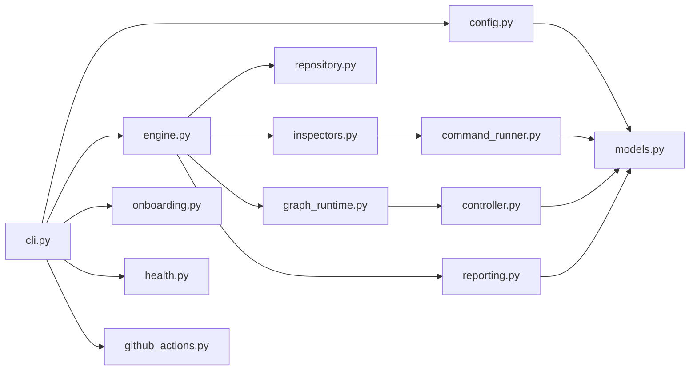

# مرجع کد پایتونی صفحهٔ کنترل

## هدف

این سند مسئولیت، ورودی، خروجی و مرز هر ماژول مرحلهٔ اول را توضیح می‌دهد. کد
پایتون در مسیر زیر قرار دارد:

`src/loop_engineering/`

## وابستگی میان ماژول‌ها



## `models.py`

مدل دامنه و واژگان مشترک را تعریف می‌کند. این فایل به لنگ‌گراف وابسته نیست.
جداسازی باعث می‌شود قرارداد کیفیت بدون موتور گردش‌کار قابل آزمون باشد.

کلاس‌های اصلی:

| کلاس | مسئولیت |
|---|---|
| `InspectionProfile` | پیکربندی تغییرناپذیر یک محصول |
| `CommandCheck` | قرارداد یک فرمان حسگر بدون پوسته |
| `CheckResult` | نتیجه و شواهد یک فرمان |
| `InspectorResult` | نتیجهٔ تجمیعی یک حوزه |
| `Finding` | تخلف یکسان‌شده و قابل اولویت‌بندی |
| `RepositorySnapshot` | اثرانگشت گیت برای محافظ فقط‌خواندنی |
| `InspectionOutcome` | گزارش کامل یک تکرار |

## `config.py`

پروفایل را بارگذاری و در دو سطح اعتبارسنجی می‌کند:

1. شِمای رسمی نسخهٔ ۲۰۲۰–۱۲؛
2. قواعد معنایی و امنیتی مستقل.

اعتبارسنجی معنایی حتی اگر کتابخانهٔ شِما در دسترس نباشد اجرا می‌شود. نمونهٔ
قواعد آن:

- شناسه‌ها قالب پایدار داشته باشند؛
- فرمان حتماً آرایه باشد؛
- پوشهٔ کاری مطلق یا دارای بخش والد نباشد؛
- بازرس فعال حداقل یک بررسی داشته باشد؛
- مهلت، اولویت و کد خروج محدود باشند.

## `command_runner.py`

فرمان را با این ویژگی‌ها اجرا می‌کند:

```text
shell = false
captured stdout and stderr
explicit timeout
bounded evidence
credential redaction
portable executable resolution
```

کد خروج ناموفق معمولاً «یافته» است، چون ابزار سالم اجرا شده است. ابزارهای
ساخت‌یافته می‌توانند کدهای شکست داخلی خود را در گزینهٔ زیر اعلام کنند:

```text
tool_error_exit_codes
```

این کدها «خطای ابزار» هستند و لوپ را امن متوقف می‌کنند. مجموعهٔ آن‌ها باید با
`success_exit_codes` مجزا باشد. نبود ابزار، پوشهٔ کاری یا اتمام مهلت نیز خطای
ابزار است.

محیط فرایند برای اجرای ابزار به ارث می‌رسد، اما در گزارش ذخیره نمی‌شود. مقدار
پیش‌فرض زیر برای رفتار غیرتعاملی ابزارها افزوده می‌شود:

```text
CI=true
```

## `inspectors.py`

کلاس `SpecialistInspector` سیاست مشترک اجرای چهار بازرس را پیاده‌سازی می‌کند.
تخصص هر بازرس در فرمان‌های نسخه‌بندی‌شدهٔ پروفایل است؛ بنابراین رفتار امنیتی
چهار حوزه یکسان باقی می‌ماند.

بازرس پس از اولین خطای ابزار متوقف می‌شود، ولی بازرس‌های مستقل دیگر می‌توانند
شواهد خود را کامل کنند. نتیجهٔ کل اجرا سپس به‌صورت امن متوقف می‌شود.

## `controller.py`

فقط توابع قطعی دارد:

```text
normalize_findings
select_one_target
```

مدل زبانی در امتیازدهی دخالت ندارد. شدت هزاران برابر اولویت محلی وزن می‌گیرد
تا یک اولویت پیکربندی‌شده نتواند به‌طور تصادفی شدت امنیتی بالاتر را کنار بزند.

## `repository.py`

با فرمان‌های فقط‌خواندنی گیت، تعهد، وضعیت، تفاوت فایل‌های ردیابی‌شده و محتوای
فایل‌های ردیابی‌نشده را هش می‌کند. این محافظ تغییر فایل‌های نادیده‌گرفته‌شده را
هدف قرار نمی‌دهد؛ آن فایل‌ها باید با اجرای ایزوله و سیاست ابزار مدیریت شوند.

اگر مخزن از ابتدا تغییرات داشته باشد، اثرانگشت همچنان تغییرات تازهٔ حین اجرا را
تشخیص می‌دهد. گزینهٔ `require_clean_start` می‌تواند شروع از مخزن ناپاک را نیز
رد کند.

## `graph_runtime.py`

دو موتور با یک قرارداد خروجی دارد:

### موتور اصلی

`langgraph`

چهار گرهٔ بازرس را از نقطهٔ شروع منشعب می‌کند، پس از پایان همه به گرهٔ کنترل
می‌رساند و فهرست‌ها را با کاهش‌دهنده تجمیع می‌کند.

### موتور راه‌اندازی

`stdlib`

با استخر رشته‌ای همان بازرس‌ها را اجرا می‌کند. هدف آن آزمون منطق قطعی پیش از
نصب وابستگی است. گزارش نام آن را `stdlib-fallback` ثبت می‌کند؛ در اجرای مرجع
نباید جای لنگ‌گراف معرفی شود.

## `engine.py`

سرویس کاربردی یک تکرار کامل است:

```text
capture before snapshot
run graph
capture after snapshot
evaluate stop rules
derive terminal status
return outcome
```

تابع `run_and_write` افزون بر اجرا، تضمین می‌کند مقصد گزارش داخل مخزن محصول
نباشد.

## `reporting.py`

فایل‌ها را ابتدا در فایل موقت همان پوشه می‌نویسد، داده را همگام می‌کند و سپس
با جایگزینی اتمی منتشر می‌سازد. فایل نهایی مانیفست، هش گزارش‌ها را نگه می‌دارد.
علاوه بر JSON و Markdown، یک گزارش HTML مستقل و یک داشبورد فهرست اجراها نیز
تولید می‌شود. همهٔ شواهد پویا پیش از ورود به HTML خنثی می‌شوند.

## `onboarding.py`

فایل‌های اعلامی متعارف مانند `package.json`، `manage.py` و `pyproject.toml` را
بدون اجرای کد پروژه بررسی می‌کند و پروفایل قابل‌حمل می‌سازد. فرمان‌های Python
از توکن `{project-python}` استفاده می‌کنند تا محیط مجازی نزدیک پروژه در صورت
وجود انتخاب شود. اسکریپت ساخت به‌صورت خودکار فعال نمی‌شود،
زیرا معمولاً داخل درخت محصول فایل می‌نویسد.

## `health.py`

پیش از اجرای حسگرها، وجود پوشه‌های کاری، executableها، Git، بازرس فعال و مقصد
امن گزارش را بررسی می‌کند و نتیجهٔ ساخت‌یافته برمی‌گرداند.

## `github_actions.py`

از همان پروفایل، jobهای مستقل و گیت نهایی GitHub Actions را می‌سازد. دسترسی
فقط خواندنی است، اکشن‌ها با SHA کامل قفل شده‌اند و لاگ‌ها به‌عنوان artifact
ثبت می‌شوند. این مولد فایل موجود را بدون گزینهٔ صریح بازنویسی نمی‌کند.

## `cli.py`

شش فرمان عمومی دارد:

```text
loop-engineering init <project>
loop-engineering validate <profile>
loop-engineering doctor <profile>
loop-engineering run <profile> [options]
loop-engineering reports <profile> [options]
loop-engineering github <profile> [options]
```

نام قدیمی `loop-inspect` برای سازگاری باقی مانده است.

کدهای خروج:

| کد | معنی |
|---:|---|
| `0` | اجرا کامل شد؛ یافته ممکن است در گزارش باشد |
| `1` | گزینهٔ شکست روی یافته فعال بود و یافته وجود داشت |
| `2` | پیکربندی، موتور، ابزار یا سیاست فقط‌خواندنی شکست خورد |

## افزودن یک بررسی

برای افزودن بررسی جدید نیازی به تغییر کد نیست. فرمان باید به بازرس مناسب در
پروفایل اضافه شود. تغییر کد فقط وقتی لازم است که قرارداد خروج یا روش اندازه‌گیری
تازه‌ای نیاز باشد.

چک‌لیست بررسی تازه:

- [ ] فرمان بدون پوسته قابل اجرا است.
- [ ] حالت بدون تخلف کد خروج مشخص دارد.
- [ ] حالت تخلف شناخته‌شده آزمایش شده است.
- [ ] فرمان فایل محصول تولید نمی‌کند.
- [ ] خروجی شامل دادهٔ حساس نیست.
- [ ] مهلت اجرا محدود است.
- [ ] شدت و اولویت دلیل ثبت‌شده دارند.
- [ ] اجرای تکراری اثرانگشت یکسان تولید می‌کند.

## افزودن عملگر در آینده

عملگر نباید به این ماژول‌ها اضافه شود. مرحلهٔ دوم باید بستهٔ جدا داشته باشد و
فقط `Finding` انتخاب‌شده را به‌عنوان ورودی دریافت کند. این جداسازی مانع تغییر
هم‌زمان حسگر و محصول می‌شود.
