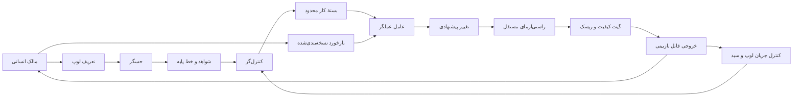

# معماری مرجع لوپ‌های چندعاملی

## هدف

این سند مرز اجزا، جریان اطلاعات و سطح اختیار نقش‌ها را برای لوپ‌های این پروژه تعریف می‌کند. جزئیات ابزار می‌توانند تغییر کنند، اما تفکیک مسئولیت‌ها باید حفظ شود.

## نمای کلان



## دو صفحهٔ معماری

### صفحهٔ کنترل

صفحهٔ کنترل تصمیم می‌گیرد چه کاری، با چه حدودی و در چه زمانی انجام شود. اجزای آن شامل تعریف لوپ، کنترل‌گر، سیاست ریسک، بودجه، شرایط توقف و کنترل جریان است.

### صفحهٔ اجرا

صفحهٔ اجرا تغییر را اعمال و شواهد را تولید می‌کند. اجزای آن شامل عامل عملگر، ابزارها، محیط ایزوله، آزمون‌ها و بستهٔ خروجی است.

عامل عملگر نباید بدون مجوز صریح، قواعد صفحهٔ کنترل را تغییر دهد.

## مسئولیت و اختیار اجزا

| جزء | مسئولیت | حق تغییر محصول | حق تغییر معیار خودش |
|---|---|---:|---:|
| حسگر قطعی | اندازه‌گیری وضعیت | خیر | خیر |
| عامل حسگر | ارزیابی معنایی محدود | خیر | خیر |
| کنترل‌گر | انتخاب هدف بعدی | خیر | فقط در تغییر طراحی لوپ |
| عامل عملگر | اعمال بستهٔ کار | بله، در حدود قرارداد | خیر |
| راستی‌آزما | سنجش نتیجه | خیر | خیر |
| گیت ریسک | اجازه یا توقف جریان | خیر | خیر |
| مالک انسانی | پذیرش، بازهدایت، توقف و افزایش اختیار | بله | بله، از طریق تغییر بازبینی‌شده |

## ترتیب ترجیح برای پیاده‌سازی نقش‌ها

برای هر نقش، ساده‌ترین سازوکار قابل اتکا انتخاب می‌شود:

1. قانون یا محاسبهٔ قطعی؛
2. ابزار تحلیل ساختاری یا آزمون؛
3. خط لولهٔ ترکیبی از ابزار قطعی و عامل؛
4. عامل زبانی با قرارداد خروجی محدود؛
5. چند عامل مستقل فقط برای خطاها یا تخصص‌های مستقل.

عامل برای کاری استفاده نمی‌شود که یک برنامهٔ قطعی با هزینه و عدم قطعیت کمتر انجام می‌دهد.

## الگوهای مجاز چندعاملی

### خط لولهٔ تخصصی

عامل‌ها به‌ترتیب روی خروجی‌های قراردادی کار می‌کنند. هر مرحله ورودی و خروجی مشخص دارد و زمینهٔ نامحدود مرحلهٔ قبل را به ارث نمی‌برد.

```text
analysis agent -> implementation agent -> verification agent
```

### عملگر و راستی‌آزمای مستقل

یک عامل تغییر را می‌سازد و عامل دیگری فقط براساس معیارهای از پیش تعریف‌شده آن را ارزیابی می‌کند. راستی‌آزما اجازهٔ تغییر بی‌سروصدای معیارها را ندارد.

### اجرای موازی ایزوله

فقط برای اهداف مستقل، محیط‌های جدا و ظرفیت بازبینی کافی مجاز است. هر شاخه باید گزارش و گیت مستقل داشته باشد.

### کنترل‌گر عامل‌محور

وقتی اولویت‌بندی به قضاوت معنایی نیاز دارد، عامل می‌تواند از میان گزینه‌هایی که حسگر تولید کرده است انتخاب کند. عامل حق اختراع کار خارج از فهرست یا عبور از حدود را ندارد.

## الگوهای غیرمجاز به‌عنوان پیش‌فرض

- تکثیر بازگشتی عامل‌ها بدون سقف؛
- اشتراک یک زمینهٔ قابل‌تغییر میان همهٔ عامل‌ها؛
- رأی‌گیری چند عامل مشابه به‌جای معیار عینی؛
- ارزیابی نهایی فقط توسط همان عاملی که تغییر را ساخته است؛
- اجرای موازی چند تغییر روی فایل‌ها یا منابع مشترک بدون قفل و ادغام مشخص؛
- دادن اختیار تغییر هدف، معیار و پیاده‌سازی به یک عامل در یک تکرار؛
- تولید خروجی جدید پیش از تعیین تکلیف خروجی قبلی.

## مرز مصنوعات

هر لوپ باید مصنوعات زیر را از هم جدا نگه دارد:

```text
loop.yaml             # control contract
skill.md              # actuator instructions
feedback.md           # durable reviewed learning
runbook.md            # operational ownership and recovery
iteration-report.md   # evidence for one run
```

خروجی‌های موقت اجرا، لاگ‌های حجیم و داده‌های حساس نباید وارد فایل بازخورد یا کنترل نسخه شوند.

## کنترل جریان در دو سطح

### سطح لوپ

هر لوپ سقف خروجی باز خود را دارد. مقدار پیش‌فرض یک است.

```text
open_outputs_for_loop <= max_open_outputs
```

### سطح سبد پروژه

مجموع خروجی‌های همهٔ لوپ‌ها نیز باید با ظرفیت واقعی تیم محدود شود.

```text
sum(open_outputs_all_loops) <= portfolio_review_capacity
```

اگر سقف سبد پر باشد، لوپ‌های زمان‌بندی‌شده باید بدون اعمال تغییر خاتمه یابند یا طبق سیاست اولویت در صف بمانند. افزودن لوپ جدید نباید این سقف را دور بزند.

صف‌ها و ظرفیت سبد در فایل زیر تعریف می‌شوند:

`config/portfolio.yaml`

هر مقدار `portfolio_capacity_key` در تعریف لوپ باید به یکی از صف‌های همین فایل اشاره کند. تا زمانی که وضعیت پیکربندی سبد فعال نشده است، هیچ لوپی نباید وارد وضعیت فعال شود.

## ایزولاسیون و هم‌زمانی

- هر اجرای تغییردهنده باید محیط کاری جدا داشته باشد.
- هر خروجی باید شناسهٔ لوپ و شناسهٔ اجرا داشته باشد.
- قفل منطقی باید از دو اجرای هم‌زمان روی یک هدف جلوگیری کند.
- اهداف موازی نباید مسیرهای نوشتن هم‌پوشان داشته باشند، مگر اینکه مرحلهٔ ادغام صریح تعریف شده باشد.
- هر اجرای منقضی یا متوقف‌شده باید قابل تشخیص باشد و قفل آن با رویهٔ ثبت‌شده آزاد شود.
- بازاجرای یک شناسهٔ اجرا نباید تغییر تکراری یا غیرقابل پیش‌بینی بسازد.

## مدل اعتماد

همهٔ خروجی‌های عامل، از جمله گزارش موفقیت، ادعای اجرای آزمون و پیشنهاد تغییر معیار، تا زمان تأیید با شواهد غیرقابل اعتماد محسوب می‌شوند.

اعتماد از این مسیر افزایش می‌یابد:

```text
observable evidence -> repeated acceptance -> bounded autonomy
```

اعتماد به یک لوپ یا یک کلاس تغییر قابل انتقال خودکار به لوپ دیگر نیست.

## منبع قواعد اجرایی

- قرارداد فیلدها و اجرای هر لوپ:

  [قرارداد تعریف و اجرای لوپ](../standards/loop-contract.md)

- گیت‌ها، ریسک و شرایط توقف:

  [گیت‌های کیفیت و سیاست ریسک](../standards/quality-gates.md)

- حالت‌های راه‌اندازی و بهره‌برداری:

  [چرخهٔ عمر عملیاتی لوپ](../operations/loop-lifecycle.md)
