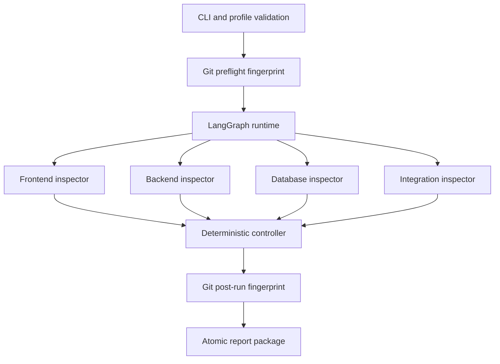

# معماری مرحلهٔ اول: مشاهدهٔ فقط‌خواندنی وب‌اپ

## هدف و مرز

این مرحله وضعیت چهار حوزه را با فرمان‌های قطعی اندازه‌گیری می‌کند، یافته‌ها را
یکسان‌سازی و مرتب می‌کند و حداکثر یک هدف را برای بررسی انسان پیشنهاد می‌دهد.

این مرحله انجام نمی‌دهد:

- تغییر کد محصول؛
- اجرای عامل کدنویس؛
- ایجاد شاخه یا درخواست ادغام؛
- تغییر مهاجرت یا داده؛
- اتصال خودکار به تولید؛
- زمان‌بندی خودکار.

## اجزای اجرایی



## قرارداد فرمان حسگر

هر بررسی شامل شناسه، عنوان، فرمان، پوشهٔ کاری، مهلت، کدهای خروج موفق، شدت و
اولویت است. فرمان آرایه است و با پوسته اجرا نمی‌شود.

```yaml
- id: django-check
  title: Django system checks
  command: [python, manage.py, check]
  working_directory: backend
  timeout_seconds: 300
  success_exit_codes: [0]
  tool_error_exit_codes: [2]
  severity_on_failure: high
  priority: 70
```

`success_exit_codes` represent a clean measurement. A non-success code normally
represents a trustworthy product finding. For structured scanners that reserve
specific process codes for scanner failure, list those codes in
`tool_error_exit_codes`; the two sets must be disjoint. Tool-error codes stop the
loop safely instead of being misreported as product defects.

### معنای نتیجه

| نتیجه | معنی |
|---|---|
| `passed` | ابزار سالم اجرا شد و کد خروج در مجموعهٔ موفق بود |
| `finding` | ابزار سالم اجرا شد و یک تخلف گزارش کرد |
| `tool_error` | ابزار اجرا نشد، منقضی شد یا شواهد قابل اعتماد نساخت |
| `skipped` | بازرس در پروفایل غیرفعال بود |

خطای ابزار هرگز به‌عنوان صفر تخلف گزارش نمی‌شود.

## کنترل‌گر

امتیاز پایه از شدت ساخته می‌شود و اولویت پیکربندی به آن افزوده می‌گردد. ترتیب
نهایی مستقل از ترتیب پایان اجرای موازی است:

```text
score descending
inspector ascending
check_id ascending
fingerprint ascending
```

اثر انگشت هر یافته از شناسهٔ پروژه، بازرس و بررسی ساخته می‌شود؛ بنابراین اجرای
مجدد همان بررسی روی همان پروژه شناسهٔ یکسان تولید می‌کند.

## اثبات فقط‌خواندنی

محافظ مخزن این داده‌ها را پیش و پس از اجرا در یک اثرانگشت ترکیب می‌کند:

- شناسهٔ تعهد جاری؛
- تفاوت فایل‌های ردیابی‌شده نسبت به تعهد؛
- نام و محتوای فایل‌های ردیابی‌نشده و نادیده‌گرفته‌نشده.

اگر اثرانگشت تغییر کند، نتیجه `aborted_safely` است. سامانه عمداً پاک‌سازی یا
بازگردانی خودکار انجام نمی‌دهد؛ زیرا ممکن است تغییر متعلق به کاربر باشد.

## قرارداد گزارش

هر اجرا یک پوشهٔ یکتا می‌سازد:

```text
artifacts/runs/<run-id>/
├── report.json
├── findings.json
├── report.md
└── manifest.json
```

- `report.json`: نتیجهٔ کامل و داده‌های اجرای جاری؛
- `findings.json`: فهرست مرتب یافته‌ها برای مقایسه و خط پایه؛
- `report.md`: گزارش قابل خواندن برای انسان؛
- `manifest.json`: هش هر سه فایل برای تشخیص خرابی یا تغییر.

شِمای گزارش:

`schemas/inspection-report.schema.json`

## محرمانگی

- محیط فرایند در گزارش ثبت نمی‌شود.
- خروجی فرمان‌ها محدود و برای چند الگوی رایج راز پوشانده می‌شود.
- پوشاندن خودکار جایگزین طراحی فرمان امن نیست.
- پروفایل نباید کلید، توکن، رمز یا نشانی اتصال تولید داشته باشد.
- گزارش حجیم یا حساس نباید وارد کنترل نسخه شود.

## وضعیت‌های اجرای مرحلهٔ اول

```text
accepted            ابزارها سالم‌اند و یافته‌ای وجود ندارد
needs_human_input   ابزارها سالم‌اند و حداقل یک یافته وجود دارد
aborted_safely      شواهد غیرقابل اعتماد یا نقض فقط‌خواندنی رخ داده است
```

## روش اتصال یک محصول

1. پیکربندی نمونه به فایل محلی کپی شود.
2. مسیر واقعی محصول ثبت شود.
3. ساختار مخزن و فرمان‌های رسمی خود پروژه بررسی شوند.
4. هر فرمان ابتدا دستی و در محیط آزمایشی اثبات شود.
5. پروفایل اعتبارسنجی شود.
6. دو اجرای متوالی روی یک تعهد مقایسه شوند.
7. فقط پس از بازبینی نتایج، وضعیت لوپ از پیش‌نویس به مشاهده‌ای تغییر کند.

## اجرای محلی

```powershell
python -m venv .venv
.\.venv\Scripts\python.exe -m pip install -e .
.\.venv\Scripts\python.exe scripts\run_inspection.py validate config\inspection.local.yaml
.\.venv\Scripts\python.exe scripts\run_inspection.py run config\inspection.local.yaml --runtime langgraph
```

ایجاد محیط و نصب وابستگی یک اقدام جدا از نوشتن کد است و باید طبق سیاست محیط
با تأیید انجام شود.
