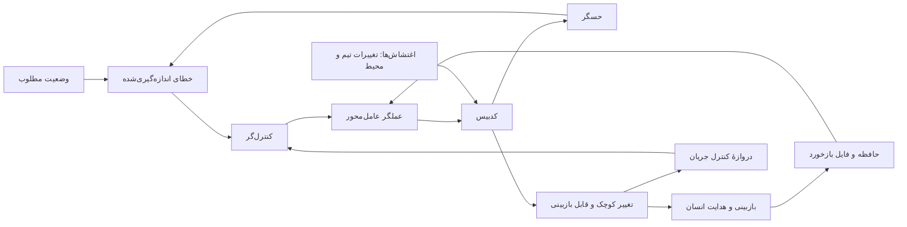

# مهندسی لوپ از اصول پایه

> سند مبنا برای طراحی لوپ‌های عامل‌محور و چندعاملی در پروژه
>
> وضعیت: نسخهٔ نخست، استخراج‌شده از ویدیو و آماده برای استفاده در تصمیم‌های معماری آینده

این فایل سند منشأ و استدلال مهندسی است. قواعد الزام‌آور پروژه در اسناد زیر نگهداری می‌شوند:

- [تصمیم ۰۰۰۱: معماری کنترل‌لوپ‌محور](../decisions/0001-control-loop-first.md)
- [قرارداد تعریف و اجرای لوپ](../standards/loop-contract.md)
- [گیت‌های کیفیت و سیاست ریسک](../standards/quality-gates.md)

## هدف این سند

این سند دانش مهندسی ویدیو را به قواعدی ماندگار و قابل اجرا برای این پروژه تبدیل می‌کند. مقصود، خلاصه‌کردن سخنرانی نیست؛ مقصود، تعریف یک مبنای مشترک برای طراحی، پیاده‌سازی و ارزیابی لوپ‌هایی است که کیفیت محصولات ساخته‌شده با وایب‌کدینگ را بالا می‌برند.

قاعدهٔ محوری پروژه از این پس چنین است:

> تعداد بیشتر عامل‌ها به‌خودی‌خود کیفیت ایجاد نمی‌کند. کیفیت زمانی بالا می‌رود که تغییرات کوچک، قابل‌اندازه‌گیری، قابل‌بازبینی و دارای بازخورد باشند.

## شناسنامهٔ منبع و روش تحلیل

- عنوان سخنرانی:

  `Loop Engineering from First Principles`

- سخنران:

  `Kyle Mistele — HumanLayer — @0xblacklight`

- نسخهٔ آنلاین:

  [YouTube — xIt_mTQp6mY](https://youtu.be/xIt_mTQp6mY)

- فایل محلی بررسی‌شده:

  `C:\Users\huoman\OneDrive\Desktop\video\VID_20260728_140146_046.mp4`

- مدت:

  `17:56.878`

- روش تحلیل: رونویسی محلی گفتار با تشخیص زبان انگلیسی، تولید ۴۰۹ بخش زمان‌دار و بازبینی هفت قاب کلیدی از اسلایدها. متن این سند بازنویسی و استنتاج مهندسی است و رونویسی کلمه‌به‌کلمه نیست.

## چکیدهٔ اجرایی

سخنرانی با یک نقد آغاز می‌شود: قراردادن یک پرامپت در حلقه، افزودن چند بازبین عامل‌محور و تولید یک تغییر بسیار بزرگ، هنوز مهندسی نرم‌افزار مطمئن نیست. خروجی ممکن است سریع و حجیم باشد، اما اگر انسان نتواند آن را بخواند و کیفیت آن قابل‌اندازه‌گیری نباشد، هزینه و ریسک به‌جای کاهش افزایش می‌یابد.

راه‌حل پیشنهادی، نگاه‌کردن به کدبیس به‌عنوان یک سیستم پویا و طراحی لوپ بر پایهٔ نظریهٔ کنترل است. هر لوپ باید هدف مطلوب، حسگر، کنترل‌گر، عملگر، بازخورد، اغتشاش‌های شناخته‌شده و قواعد توقف داشته باشد. تغییر باید تدریجی باشد و هر تکرار یک واحد کوچک، قابل بررسی و کم‌ریسک تولید کند.

برای کاربرد واقعی، سخنرانی چهار لایهٔ تکمیلی اضافه می‌کند: جلوگیری از ایجاد بدهی جدید، استفاده از نمونه‌های طلایی و مهارت نسخه‌بندی‌شده، هدایت کم‌اصطکاک انسان از طریق فایل بازخورد، و کنترل جریان تطبیقی برای جلوگیری از انباشته‌شدن کار بازبینی‌نشده.

## مدل پایه: کدبیس به‌عنوان سیستم کنترل‌شونده



### نگاشت اجزا به مهندسی نرم‌افزار

| جزء | مسئولیت | نمونه‌ها |
|---|---|---|
| وضعیت مطلوب | تعریف روشن و قابل‌اندازه‌گیری از کیفیت مورد انتظار | انطباق با قرارداد رابط، حذف یک الگوی نامطلوب، تکمیل مهاجرت |
| حسگر | اندازه‌گیری فاصلهٔ وضعیت فعلی از هدف | آزمون، لینتر، تحلیل ساختاری، تله‌متری، عامل ارزیاب |
| خطا | فهرست مرتب و قابل‌ردیابی از مغایرت‌ها | تخلف، تست شکست‌خورده، شکاف پوشش، خطای عملیاتی |
| کنترل‌گر | انتخاب کوچک‌ترین یا باارزش‌ترین تغییر بعدی | نخستین تخلف قطعی، کوچک‌ترین تابع، مورد دارای بیشترین خطا |
| سیگنال کنترل | بستهٔ دقیق کار برای یک تکرار | هدف انتخاب‌شده به‌همراه داده، محدودیت و معیار پذیرش |
| عملگر | اعمال تغییر محدود به سیستم | عامل کدنویس به‌همراه مهارت و نمونهٔ طلایی |
| بازخورد | سنجش نتیجه و اصلاح رفتار تکرار بعدی | نتیجهٔ تست، نظر بازبین، کامنت درخواست اصلاح، فایل حافظه |
| اغتشاش | تغییر بیرونی که سیستم را از هدف دور می‌کند | کد جدید هم‌تیمی‌ها، تغییر وابستگی، تغییر مشخصات |
| کنترل جریان | محدودکردن نرخ تولید نسبت به ظرفیت بازبینی | حداکثر یک درخواست ادغام باز برای هر لوپ |

مرجع تصویری این مدل در حدود زمان زیر دیده می‌شود:

[07:07 — Agentic Control Loops](https://youtu.be/xIt_mTQp6mY?t=427)

## معماری مرجع یک لوپ در این پروژه

چرخهٔ استاندارد پروژه باید به این ترتیب باشد:

```text
SENSE -> CONTROL -> ACTUATE -> VERIFY -> LEARN -> FLOW-GATE
```

### ۱. تعریف هدف و مرزها

پیش از اجرای عامل باید یک ویژگی مشخص از محصول انتخاب شود. عباراتی مانند «کد را بهتر کن» یا «کل پروژه را کامل کن» نقطهٔ تنظیم محسوب نمی‌شوند. هدف باید به یک خروجی قابل سنجش تبدیل شود.

هر تعریف هدف حداقل باید شامل این موارد باشد:

- وضعیت مطلوب؛
- روش اندازه‌گیری وضعیت فعلی؛
- واحد مجاز تغییر در هر تکرار؛
- سقف دامنهٔ اثر؛
- معیار پذیرش؛
- شرایط توقف؛
- مالک انسانی نتیجه.

### ۲. ساخت حسگر پیش از ساخت عامل

حسگر باید تا حد امکان قطعی، تکرارپذیر و خارج از اختیار عامل عملگر باشد. اگر یک بررسی را می‌توان با کد قطعی انجام داد، نباید آن را به عامل زبانی واگذار کرد.

نمونه ابزارهای اشاره‌شده در ویدیو:

```text
ESLint
ast-grep
rg
Packwerk
React Doctor
tests
telemetry
```

حسگر می‌تواند ترکیبی باشد: ابزار قطعی تخلف‌ها را پیدا کند و عامل فقط موارد مبهم یا معنایی را طبقه‌بندی کند. چندعامل‌بودن در اینجا زمانی مفید است که هر عامل یک خطای مستقل و تعریف‌شده را بسنجد؛ تکرار شش بازبینی مشابه، جایگزین معیار عینی نیست.

### ۳. متوقف‌کردن ایجاد بدهی جدید

پیش از پاک‌سازی تدریجی بدهی موجود، باید از اضافه‌شدن موارد جدید جلوگیری شود. الگوی ارائه‌شده چنین است:

1. یک بار کل کدبیس اسکن شود.
2. خروجی به فیلدهای ضروری کاهش یابد.
3. نتیجه به‌شکل قطعی مرتب شود.
4. خط پایه در کنترل نسخه ثبت شود.
5. هر تغییر جدید نسبت به خط پایه سنجیده شود.
6. ایجاد تخلف جدید در خط لوله رد شود.

این لایه نقش میراکنندهٔ اغتشاش را دارد؛ کار روزمرهٔ تیم نباید نتیجهٔ لوپ اصلاحی را خنثی کند.

مرجع ویدیویی:

[10:44 — خط پایهٔ قطعی و کنترل بدهی جدید](https://youtu.be/xIt_mTQp6mY?t=644)

### ۴. طراحی کنترل‌گر با کمترین عدم قطعیت

کنترل‌گر وظیفه دارد فقط «تغییر بعدی» را انتخاب کند، نه اینکه کل هدف را یک‌باره محقق کند. سیاست انتخاب باید تا حد امکان قطعی باشد.

ترتیب ترجیح پیشنهادی:

1. کوچک‌ترین واحدی که معیار را بهبود می‌دهد؛
2. موردی با بیشترین اثر عملیاتی بر پایهٔ تله‌متری؛
3. موردی با بالاترین شدت یا ریسک؛
4. تصمیم عامل فقط زمانی که رتبه‌بندی به قضاوت معنایی واقعی نیاز دارد.

سیگنال کنترل می‌تواند علاوه بر نشانی کد، داده‌های عملیاتی مرتبط را نیز حمل کند؛ برای مثال نرخ خطا، کمبود مشاهده‌پذیری یا شکاف ابزار پایش. هدف این است که عامل صرفاً یک تبدیل مکانیکی انجام ندهد و واقعاً کیفیت را بهتر کند.

### ۵. ساخت عملگر از عامل، مهارت و الگوی طلایی

عملگر مناسب تنها یک پرامپت نیست. بستهٔ عملگر باید شامل اجزای زیر باشد:

- یک عامل کدنویس؛
- یک مهارت نسخه‌بندی‌شده با دستورالعمل حل؛
- نمونه‌های طلایی نوشته‌شده و تأییدشده توسط انسان؛
- محدودیت دامنه و فایل‌های مجاز؛
- معیارهای آزمون و بازبینی؛
- قالب پاسخ نهایی و گزارش شواهد.

نمونهٔ طلایی مهم است، زیرا عامل‌ها تکثیرکنندهٔ الگو هستند. در نبود الگوی محلی معتبر، عامل به مستندات عمومی یا الگوهای آموخته‌شده از اینترنت تکیه می‌کند که ممکن است با معماری پروژه سازگار نباشند.

مهارت نباید یک‌بار برای همیشه نوشته شود. بازخورد اجرای واقعی باید به اصلاح تدریجی آن منجر شود.

### ۶. یک تکرار، یک تغییر کوچک، یک درخواست ادغام

زیرساخت پیوستهٔ موجود محل مناسب اجرای لوپ است؛ زیرا به کد، زمان‌بندی، رخدادها و مجوزهای از پیش تعریف‌شده دسترسی دارد. هر اجرای زمان‌بندی‌شده فقط یک تکرار کامل انجام می‌دهد:

```text
sense -> select one bounded target -> change -> verify -> commit -> open PR
```

در ویدیو، اجرای روزانه پیشنهاد می‌شود تا تیم هر بار با یک تغییر کوچک و قابل‌خواندن روبه‌رو شود، نه یک درخواست ادغام عظیم.

مرجع ویدیویی:

[13:20 — اجرای لوپ با GitHub Actions](https://youtu.be/xIt_mTQp6mY?t=800)

## انسان روی حلقه، نه بیرون از آن

هدف حذف مالکیت انسانی نیست. انسان باید بتواند با اصطکاک کم، رفتار لوپ را در حین کار اصلاح کند.

الگوی پیشنهادشده:

1. هر لوپ یک فایل بازخورد متنی و نسخه‌بندی‌شده داشته باشد.
2. این فایل در هر اجرا به‌صورت قطعی وارد زمینهٔ عامل شود.
3. درخواست‌های ادغام هر لوپ با برچسب اختصاصی قابل‌شناسایی باشند.
4. یک فرمان صریح در نظر بازبین، اجرای اصلاحی را فعال کند.
5. اجرای اصلاحی، تفاوت کد، توضیح، نظرها و بازبینی‌ها را به عامل بدهد.
6. عامل هم کد و هم فایل بازخورد را به‌روزرسانی کند.

مزیت فایل نسخه‌بندی‌شده این است که تاریخچهٔ یادگیری لوپ دیده، بازبینی و در صورت نیاز بازگردانی می‌شود. این فایل حافظهٔ پنهان یا غیرقابل حسابرسی نیست.

مرجع ویدیویی:

[14:13 — فایل بازخورد و هدایت کم‌اصطکاک](https://youtu.be/xIt_mTQp6mY?t=853)

## کنترل جریان تطبیقی

اگر ظرفیت تولید عامل از ظرفیت بازبینی انسان بیشتر شود، صف درخواست‌ها به‌سرعت بی‌ارزش می‌شود: کارها تکراری، متعارض یا قدیمی می‌شوند. راه‌حل ساده و قدرتمند ویدیو این است:

> اگر برای یک لوپ درخواست ادغام بازی وجود دارد، اجرای زمان‌بندی‌شدهٔ بعدی بدون تغییر خاتمه یابد.

نتیجه، حداکثر یک خروجی بازبینی‌نشده برای هر لوپ است. این قاعده فشار معکوس ایجاد می‌کند و نرخ تولید را با نرخ جذب تیم هماهنگ نگه می‌دارد.

این اصل برای لوپ‌های محلی نیز تعمیم دارد: تا وقتی نتیجهٔ تکرار قبلی ارزیابی یا پذیرفته نشده است، تکرار تازه‌ای روی همان هدف ساخته نشود.

مرجع ویدیویی:

[15:40 — توقف خودکار در حضور خروجی باز](https://youtu.be/xIt_mTQp6mY?t=940)

## افزایش سرعت فقط پس از پایداری

سرعت یک پارامتر کنترل است، نه هدف اولیه. پس از آنکه لوپ خروجی‌های کوچک و قابل اعتماد تولید کرد، می‌توان سرعت را با یکی از روش‌های زیر افزایش داد:

- انتخاب چند واحد کوچک در هر اجرا با سقف روشن؛
- دادن پنجرهٔ زمینهٔ مستقل به هر واحد؛
- اجرای چند نمونهٔ مستقل برای چند بازبین انسانی مستقل؛
- افزایش تدریجی نرخ بر اساس نرخ پذیرش و زمان بازبینی.

نباید چند تغییر نامرتبط در یک زمینهٔ بزرگ ادغام شوند. زمینه‌های مستقل معمولاً هم ارزان‌ترند و هم احتمال آلودگی تصمیم و خطای زنجیره‌ای را کم می‌کنند.

## پیامد مستقیم برای طراحی چندعاملی این پروژه

### چندعاملی‌بودن ابزار است، نه معماری پیش‌فرض

یک لوپ با حسگر قطعی و یک عامل عملگر ممکن است از یک گروه بزرگ عامل‌ها بهتر باشد. عامل جدید فقط وقتی اضافه می‌شود که یکی از این نیازها وجود داشته باشد:

- اندازه‌گیری مستقل یک نوع خطا؛
- تخصص واقعاً متفاوت؛
- جداسازی زمینه برای جلوگیری از تداخل؛
- ارزیابی خصمانه با معیار پذیرش روشن؛
- افزایش ظرفیت پس از اثبات پایداری.

### جداسازی نقش‌ها

معماری مرجع چندعاملی پروژه باید این نقش‌ها را از هم جدا نگه دارد:

| نقش | ماهیت ترجیحی | خروجی |
|---|---|---|
| حسگر | قطعی یا ترکیبی | فهرست تخلف‌های قابل بازتولید |
| کنترل‌گر | قطعی تا حد ممکن | یک بستهٔ کار محدود و اولویت‌دار |
| عملگر | عامل متخصص | تغییر کوچک به‌همراه گزارش شواهد |
| راستی‌آزما | ابزار قطعی و در صورت نیاز عامل مستقل | پذیرش، رد یا درخواست اصلاح |
| حافظه | فایل نسخه‌بندی‌شده | قواعد آموخته‌شده و قابل حسابرسی |
| مالک انسانی | تصمیم‌گیر نهایی جریان | ادغام، بازهدایت، توقف یا افزایش سرعت |

عامل عملگر نباید حسگر یا معیار پذیرش خود را بی‌سروصدا تغییر دهد. تغییر هم‌زمان کد، معیار و خط پایه باید یک تغییر معماری مجزا و قابل بازبینی باشد.

### قرارداد استاندارد یک تکرار

ورودی هر تکرار باید شامل این موارد باشد:

```yaml
loop_id: شناسه یکتا
setpoint: وضعیت مطلوب قابل اندازه گیری
selected_target: فقط یک واحد محدود
evidence: خروجی حسگر و داده عملیاتی
constraints: محدوده و ممنوعیت ها
golden_patterns: نمونه های تایید شده
feedback_file: حافظه نسخه بندی شده
acceptance_checks: آزمون های لازم
stop_conditions: شرایط توقف فوری
```

خروجی هر تکرار باید دست‌کم شامل این موارد باشد:

- تغییر محدود؛
- شواهد پیش و پس از تغییر؛
- نتیجهٔ آزمون‌ها؛
- ریسک‌ها و فرض‌ها؛
- موارد خارج از دامنه؛
- پیشنهاد تکرار بعدی، بدون اجرای خودکار آن؛
- به‌روزرسانی فایل بازخورد فقط در صورت وجود یادگیری تعمیم‌پذیر.

## حفاظ‌ها و شرایط توقف

هر لوپ باید در یکی از شرایط زیر متوقف شود:

- هدف یا معیار پذیرش مبهم شده است؛
- حسگر نتیجهٔ قابل تکرار تولید نمی‌کند؛
- تکرار قبلی هنوز بازبینی نشده است؛
- تغییر از سقف دامنهٔ اثر عبور می‌کند؛
- آزمون‌های پایه شکست می‌خورند؛
- تغییر جدید تخلف تازه ایجاد می‌کند؛
- دو تکرار پیاپی پیشرفت قابل‌اندازه‌گیری ندارند؛
- بازخوردها متناقض‌اند و تصمیم انسانی لازم است؛
- هزینه، زمان یا بودجهٔ از پیش تعیین‌شده عبور کرده است؛
- بازگردانی یا توقف امن مشخص نیست.

## معیارهای سنجش کیفیت لوپ

کیفیت لوپ با حجم کد یا تعداد اجرای عامل سنجیده نمی‌شود. داشبورد ارزیابی آینده باید دست‌کم این شاخص‌ها را داشته باشد:

- کاهش خطای اندازه‌گیری‌شده در هر تکرار؛
- تعداد تخلف‌های جدید؛
- اندازهٔ تغییر و تعداد فایل‌های درگیر؛
- زمان لازم برای بازبینی انسانی؛
- نرخ پذیرش بدون اصلاح؛
- نرخ بازکاری، بازگردانی و شکست؛
- تکرارشدن یک نوع بازخورد انسانی؛
- هزینهٔ محاسباتی و توکن به‌ازای تغییر پذیرفته‌شده؛
- زمان ماندن خروجی در صف؛
- نسبت خروجی تولیدشده به خروجی واقعاً ادغام‌شده.

## ضدالگوهایی که باید رد شوند

- حلقهٔ کور پرامپت که تا «تمام‌شدن» نامشخص ادامه می‌یابد؛
- درخواست ادغام بسیار بزرگ که هیچ‌کس توان خواندنش را ندارد؛
- استفاده از عامل برای کاری که کد قطعی بهتر انجام می‌دهد؛
- افزودن بازبین‌های مشابه بدون معیار مستقل؛
- اجرای هم‌زمان چند تغییر مرتبط در یک زمینهٔ آلوده؛
- اتکا به مستندات عمومی به‌جای نمونهٔ طلایی پروژه؛
- زمان‌بندی بدون فشار معکوس و بدون سقف خروجی باز؛
- ادغام خودکار پیش از اثبات پایداری و تعریف کلاس ریسک؛
- حافظهٔ پنهان و غیرقابل حسابرسی؛
- تغییر معیار ارزیابی توسط همان عاملی که باید براساس آن سنجیده شود؛
- افزایش سرعت پیش از اندازه‌گیری کیفیت و ظرفیت بازبینی.

## چک‌لیست پذیرش یک لوپ جدید

پیش از فعال‌شدن هر لوپ، پاسخ همهٔ موارد زیر باید روشن باشد:

- [ ] هدف مطلوب دقیق و قابل‌اندازه‌گیری است.
- [ ] حسگر خروجی قابل تکرار تولید می‌کند.
- [ ] خط پایه و شیوهٔ جلوگیری از پسرفت تعریف شده است.
- [ ] سیاست انتخاب تغییر بعدی محدود و شفاف است.
- [ ] سقف اندازهٔ هر تغییر مشخص است.
- [ ] نمونهٔ طلایی تأییدشده وجود دارد.
- [ ] مهارت و قالب گزارش نسخه‌بندی شده‌اند.
- [ ] آزمون‌ها و راستی‌آزمای مستقل از عملگر هستند.
- [ ] مسیر بازخورد انسانی کم‌اصطکاک است.
- [ ] حافظهٔ یادگیری قابل مشاهده و بازگردانی است.
- [ ] دروازهٔ کنترل جریان از انباشته‌شدن خروجی جلوگیری می‌کند.
- [ ] شرایط توقف و مسیر بازگردانی تعریف شده‌اند.
- [ ] مالک انسانی و سطح اختیار ادغام مشخص است.
- [ ] شاخص‌های کیفیت و هزینه ثبت می‌شوند.

## تصمیم‌های پایهٔ پروژه

تا زمانی که یک سند تصمیم معماریِ بررسی‌شده این موارد را تغییر نداده باشد، اصول زیر مبنای پروژه هستند:

1. واحد پایهٔ اتوماسیون، «تکرار کنترل‌شده» است؛ نه نشست نامحدود عامل.
2. هر تکرار باید یک بهبود قابل‌اندازه‌گیری و محدود تولید کند.
3. ابزار قطعی بر عامل زبانی مقدم است.
4. تعداد عامل‌ها با نیازهای مستقل توجیه می‌شود، نه با امید به اجماع.
5. کیفیت خروجی باید برای انسان قابل خواندن و مالکیت‌پذیر باقی بماند.
6. بازخورد، حافظه و تغییر مهارت باید نسخه‌بندی و قابل حسابرسی باشند.
7. هر لوپ باید فشار معکوس، سقف کار باز و شرایط توقف داشته باشد.
8. خودکارسازی ادغام یا افزایش سرعت فقط پس از شواهد پایداری مجاز است.

## جمع‌بندی منبع

پیام نهایی سخنرانی این است که لوپ‌های عامل‌محور می‌توانند کد را تدریجی بهتر کنند، در حالی که انسان همچنان کد را می‌خواند و مالک نتیجه می‌ماند. مدیریت ریسک از راه تغییر کوچک، کنترل جریان تطبیقی و امکان بازهدایت سریع، تفاوت میان یک حلقهٔ نمایشی و یک سیستم مهندسی‌شدهٔ قابل استفاده در دنیای واقعی است.

مرجع ویدیویی:

[16:58 — جمع‌بندی اصول](https://youtu.be/xIt_mTQp6mY?t=1018)
