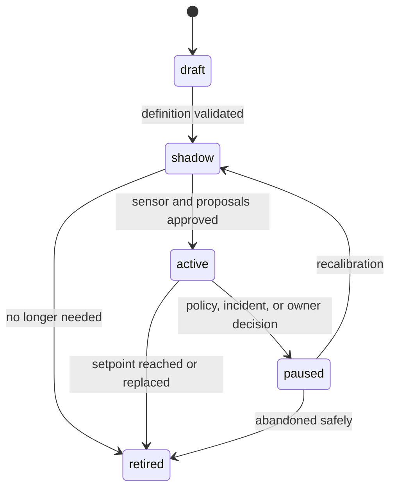
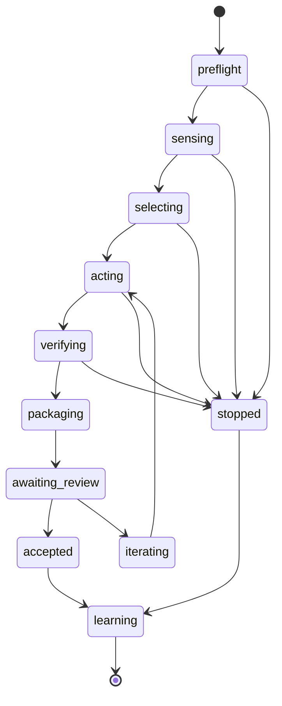

# چرخهٔ عمر عملیاتی لوپ

## هدف

این سند مسیر یک لوپ را از ایده تا بازنشستگی تعریف می‌کند. فعال‌کردن لوپ یک رویداد دفعی نیست؛ سطح اختیار باید مرحله‌ای افزایش یابد.

## حالت‌های چرخهٔ عمر



### پیش‌نویس

هدف، قرارداد، حسگر، مهارت و ران‌بوک نوشته می‌شوند. هیچ تغییر خودکاری در محصول مجاز نیست.

معیار خروج:

- تعریف با شِما معتبر است؛
- همهٔ فایل‌های الزامی وجود دارند؛
- مالک و سطح ریسک تأیید شده‌اند؛
- حسگر روی نمونه‌های شناخته‌شده آزمایش شده است.

### مشاهده‌ای

لوپ حس می‌کند، هدف انتخاب می‌کند و می‌تواند پیشنهاد یا تفاوت آزمایشی بسازد، اما خروجی را وارد جریان ادغام نمی‌کند.

در این مرحله باید خطاهای مثبت و منفی حسگر، کیفیت انتخاب کنترل‌گر، اندازهٔ واقعی تغییر و هزینه اندازه‌گیری شوند.

### فعال

لوپ اجازه دارد در حدود قرارداد خروجی قابل بازبینی ایجاد کند. مقدارهای اولیه باید محافظه‌کارانه باشند:

```text
batch_size = 1
max_open_outputs = 1
parallelism = 1
human_gate = required
```

افزایش این مقدارها فقط طبق سیاست گیت کیفیت انجام می‌شود.

### متوقف موقت

زمان‌بندی و ایجاد تغییر غیرفعال است، اما تعریف، شواهد و تاریخچه حفظ می‌شوند. توقف می‌تواند ناشی از حادثه، تغییر معماری، تعارض بازخورد یا تصمیم مالک باشد.

بازگشت مستقیم از توقف به فعالیت مجاز نیست؛ لوپ ابتدا باید دوباره در حالت مشاهده‌ای کالیبره شود.

### بازنشسته

هدف محقق، منسوخ یا با لوپ دیگری جایگزین شده است. زمان‌بندی، مجوزها و قفل‌ها حذف یا غیرفعال می‌شوند، اما سوابق لازم برای حسابرسی باقی می‌مانند.

## فرایند راه‌اندازی

### مرحلهٔ ۱: تعریف مسئله

- یک خاصیت محصول انتخاب شود.
- خطای قابل اندازه‌گیری تعریف گردد.
- محدودهٔ اثر و مالک مشخص شوند.
- سطح ریسک تعیین شود.

### مرحلهٔ ۲: اثبات حسگر

- حسگر روی حالت‌های مثبت و منفی شناخته‌شده اجرا شود.
- خروجی به‌شکل قطعی مرتب گردد.
- خط پایه ثبت شود.
- شکست ابزار از نبود تخلف جدا شود.

### مرحلهٔ ۳: ساخت نمونهٔ طلایی

حداقل یک تغییر مطلوب توسط انسان یا با بازبینی دقیق ساخته شود. این نمونه باید سبک، آزمون، مرز معماری و گزارش مورد انتظار را نشان دهد.

### مرحلهٔ ۴: تکمیل عملگر و ران‌بوک

مهارت، مسیرهای مجاز، فرمان‌های راستی‌آزمایی، شرایط توقف، مسیر بازگردانی و روش مالکیت عملیات ثبت شوند.

### مرحلهٔ ۵: اجرای مشاهده‌ای

چند اجرای بدون انتشار انجام شود. اختلاف میان پیشنهاد عامل و تصمیم بازبین ثبت گردد. بازخوردهای تکراری به اصلاح مهارت یا حسگر تبدیل شوند.

### مرحلهٔ ۶: پایلوت فعال

لوپ با کمترین نرخ، یک هدف در هر تکرار و گیت انسانی کامل فعال شود. اولین شکست سیاستی، لوپ را متوقف می‌کند.

### مرحلهٔ ۷: تنظیم و افزایش تدریجی

فقط یک پارامتر در هر تغییر تنظیم شود تا علت اثر قابل تشخیص بماند:

```text
schedule
batch_size
parallelism
max_open_outputs
human_gate scope
```

## وضعیت‌های یک اجرا



هر گذار باید یک رخداد یا شاهد مشخص داشته باشد. پرش مستقیم از اعمال تغییر به پذیرش مجاز نیست.

## بازخورد و حافظه

بازخورد اجرای جاری ابتدا در گزارش همان اجرا ثبت می‌شود. ورود آن به فایل بازخورد پایدار فقط زمانی مجاز است که:

- به یک مورد خاص و موقت محدود نباشد؛
- با استانداردهای پروژه تعارض نداشته باشد؛
- دلیل و منشأ آن مشخص باشد؛
- بازبین انسانی آن را پذیرفته باشد؛
- به‌صورت قاعدهٔ قابل اجرا یا نمونهٔ روشن نوشته شود.

فایل بازخورد نباید به دفترچهٔ تاریخچهٔ طولانی تبدیل شود. موارد منسوخ باید با تغییر بازبینی‌شده اصلاح یا حذف شوند.

## کنترل صف و فشار معکوس

پیش از دریافت کد و نصب وابستگی‌ها، اجرا باید دو پرسش را پاسخ دهد:

1. آیا برای همین لوپ خروجی باز وجود دارد؟
2. آیا ظرفیت سبد پروژه پر شده است؟

اگر پاسخ هرکدام مثبت باشد، رفتار پیش‌فرض خاتمهٔ بدون تغییر است. این تصمیم باید به‌عنوان نتیجهٔ سالم کنترل جریان ثبت شود، نه خطای اجرا.

## حادثه و بازگردانی

در صورت پسرفت، بازگردانی یا نقض گیت:

1. لوپ متوقف موقت شود.
2. زمان‌بندی و اجرای مجدد غیرفعال گردد.
3. خروجی‌های باز شناسایی و از ادامهٔ خودکار جلوگیری شود.
4. تغییر آسیب‌زا با روش ران‌بوک بازگردانی شود.
5. حسگر، مهارت، حدود و بازخورد بررسی شوند.
6. علت و اقدام اصلاحی ثبت گردد.
7. لوپ فقط از حالت مشاهده‌ای دوباره آغاز شود.

تغییر معیار برای پنهان‌کردن حادثه مجاز نیست.

## بازنشستگی

لوپ زمانی بازنشسته می‌شود که هدف محقق شده، حسگر دیگر معتبر نیست، مالکیت از بین رفته یا لوپ دیگری آن را جایگزین کرده است.

چک‌لیست بازنشستگی:

- [ ] زمان‌بندی غیرفعال شده است.
- [ ] مجوزهای اختصاصی پس گرفته شده‌اند.
- [ ] قفل‌ها و منابع موقت پاک شده‌اند.
- [ ] خروجی‌های باز تعیین تکلیف شده‌اند.
- [ ] وضعیت نهایی معیار ثبت شده است.
- [ ] دلیل و جایگزین احتمالی مستند شده‌اند.
- [ ] شواهد لازم برای حسابرسی حفظ شده‌اند.
